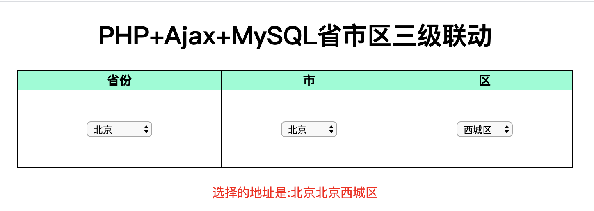

# region

PHP+Ajax+MySQL 实现省市区三级联动



```
.
├── README.md
├── app
│   ├── conn.inc.php
│   ├── mysqli.php
│   └── region_action.php 
├── public
│   ├── index.html
│   ├── region.css
│   └── region.js
├── region.png
├── region.sql
└── src
    └── jquery-3.4.1.js
```
